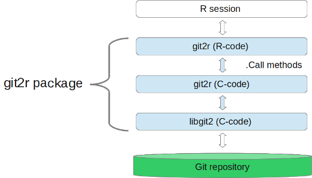

# Welcome to git2r!

Contributions to the `git2r` project are welcome and appreciated. Here follows a guideline and description of the project to make it easier for you to create pull requests, report issues and give feedback.

## Licensing

By contributing to git2r, you agree to release your contribution under the terms of the [GPL v2 license](LICENSE).

## Overall design `git2r <- libgit2 + R`

Internally the git2r package use the [libgit2](https://libgit2.github.com/) C library to interface a Git repository. C code can be called from R using the `.Call` method. However, in order to map the R data structures to C data structures used by libgit2 an intermediate layer of C code is between the R methods and libgit2, see figure below.



### R code

The package is based on S4 classes/methods. Each S4 class is prefixed with `git_` to have the same name as the corresponding libgit2 data structure. The naming strategy for methods is to use the data structure (branch, note, stash) followed by the action (create, list, remove) e.g. note_create, note_list and note_remove etc. However, the naming is not completely consistent in the package, e.g. `init` instead of `repository_init`.


#### Documentation

The package documentation is written with [roxygen2](http://cran.r-project.org/web/packages/roxygen2/index.html) version 4.0.1.  All contributed methods and classes must be documented. Moreover, all exported methods should have examples of their usage. Please file an issue if you spot a method in the documentation without an example, or better a pull request. The recommended way to generate man files from the roxygen documentation is to run the `roxygen` target in the `Makefile`

```
make roxygen
```

### Tests

The tests for the package can be found in the `tests` folder. All contributions of code should have corresponding tests.

### C code

The `git2r` C code is in files prefixed with `git2r_` in the `src` folder. The `libgit2` C code is located in `src/libgit2` with dependencies in `src/http-parser` and `src/regex`.

#### Naming

The git2r C functions are named with the prefix `git2r_module` where `module` group related functionality e.g. `git2r_repository_open` and `git2r_repository_init`. The source code for each module is in `git2r_module.c` and `git2r_module.h`.

#### Code layout

1. **Argument checking:** All R arguments must be checked prior to their usage. There exists several help functions in `src/git2r_arg.h` to facilitate argument checking. The `repo` argument is checked in the `git2r_repository_open` function and returns `NULL` on failure.

2. **Perform the actual work:** The error code (return value) from each call to a libit2 function must be checked. In case of an error initiate cleanup.

3. **Cleanup:** All allocated resources must be freed. In case of an error, call `Rf_error` with the error message.

#### Documentation

Document functions and parameters with Doxygen to enable generation of documentatation of the internal git2r C code.

### Code style

It's very important to have a consistent code style, so before submitting, make sure the code is matching surrounding code.

### Makefile

To facilitate development a [Makefile](Makefile) exists in the root folder with targets for several common tasks. For an introduction to make, see e.g. the [minimal make](http://kbroman.github.io/minimal_make/) tutorial by Karl Broman.

* **roxygen** Rebuild R documentation with [roxygen2](http://cran.r-project.org/web/packages/roxygen2/index.html). Checks that the correct version of *roxygen2* is installed.

* **check** Build package and them run `R CMD check` to [test](http://cran.r-project.org/doc/manuals/r-release/R-exts.html#Checking-packages) the package.

* **check_valgrind** Build package and then run `R CMD check` with [valgrind](http://valgrind.org/) to detect possible problems.

* **valgrind** Run all test code with valgrind.

* **sync_libgit2** Sync git2r with changes in the libgit2 C-library

  1. Clone or pull libgit2 to parent directory from https://github.com/libgit2/libgit2.git

  2. Run `make sync_libgit2`. It first removes files and then copy files from libgit2 directory. Next it runs an R script to build Makevars.in and Makevars.win based on source files. Finally it runs a `grep` command to identify potential lines in the source code using `printf`.

  3. To [pass](http://cran.r-project.org/doc/manuals/r-release/R-exts.html#Writing-portable-packages) `R CMD check git2r` the printf calls must be changed to use the R [printing](http://cran.r-project.org/doc/manuals/r-release/R-exts.html#Printing) routine `Rprintf`. Check the identified lines in the previous step and change them to use Rprintf.

  4. Build and check updated package `make check`

* **Makevars** The code in src is compiled with a [Makevars](http://cran.r-project.org/doc/manuals/r-release/R-exts.html#Using-Makevars) file ([Makevars.in](src/Makevars.in) and [Makevars.win](src/Makevars.win)). They are automatically generated from an R [script](tools/build_Makevars.r) when running this target.

* **configure** Generate a `configure` script from `configure.ac` with [autoconf](https://www.gnu.org/software/autoconf/). The [configure](http://cran.r-project.org/doc/manuals/r-release/R-exts.html#Configure-and-cleanup) script is used on non-Windows platforms to generate a system-dependent configuration and detect e.g. `OpenSSL` and `LibSSH2` before installation.

* **clean** Remove temporary and object files.

### If you have any questions, please don't hesitate to open an issue
