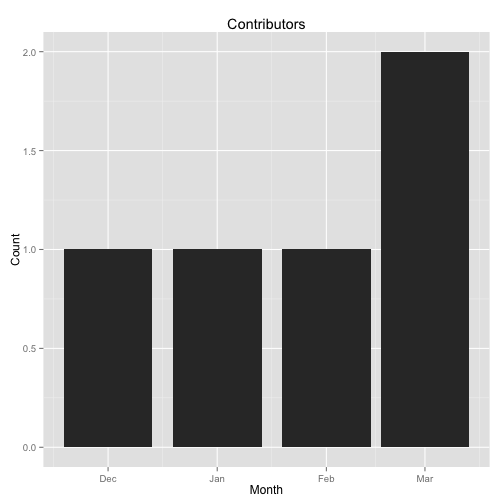
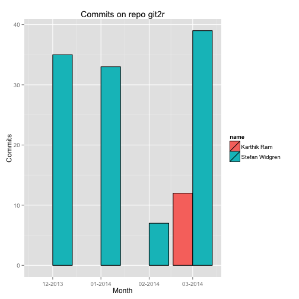

[](https://travis-ci.org/ropensci/git2r)

git2r
=====

R bindings to [libgit2](https://github.com/libgit2/libgit2) library. The package uses the source code of `libgit2` to interface a Git repository from R.

Aim
---

The aim of the package is to be able to run some basic git commands on a repository from R. Another aim is to extract and visualize descriptive statistics from a git repository.

Development
-----------

The package is in a very early development phase and is considered unstable with only a few features implemented.

Installation
------------

I'm developing the package on Linux, so it's very possible that other platforms currently fails to install the package. But feel free to look into that.

To install the development version of `git2r`, it's easiest to use the devtools package:


```r
# install.packages("devtools")
library(devtools)
install_github("git2r", "ropensci")
```


Example
-------


```r
library(git2r)

# Open an existing repository
# repo <- repository("path/to/git2r")
repo <- repository(getwd())

# Brief summary of repository
repo
```

```
#> Remote:   @ origin (https://github.com/ropensci/git2r)
#> Local:    README_fix /Users/karthik/Documents/work/Github/ropensci/git2r/
```

```r

# Summary of repository
summary(repo)
```

```
#> Remote:   @ origin (https://github.com/ropensci/git2r)
#> Local:    README_fix /Users/karthik/Documents/work/Github/ropensci/git2r/
#> 
#> Branches:      4
#> Tags:          0
#> Commits:       127
#> Contributors:  2
```

```r

# Workdir of repository
workdir(repo)
```

```
#> [1] "/Users/karthik/Documents/work/Github/ropensci/git2r/"
```

```r

# Check if repository is bare
is.bare(repo)
```

```
#> [1] FALSE
```

```r

# Check if repository is empty
is.empty(repo)
```

```
#> [1] FALSE
```

```r

# List all references in repository
references(repo)
```

```
#> $`refs/heads/master`
#> [88223a] master
#> 
#> $`refs/heads/README_fix`
#> [9ef171] README_fix
#> 
#> $`refs/remotes/origin/example_fix`
#> [1dda04] origin/example_fix
#> 
#> $`refs/remotes/origin/HEAD`
#> refs/remotes/origin/HEAD => refs/remotes/origin/master
#> 
#> $`refs/remotes/origin/master`
#> [88223a] origin/master
#> 
#> $`refs/remotes/origin/README_fix`
#> [9ef171] origin/README_fix
#> 
#> $`refs/remotes/origin/travis_fix`
#> [9089f6] origin/travis_fix
#> 
#> $`refs/stash`
#> [3eb2cc] stash
```

```r

# List all branches in repository
branches(repo)
```

```
#> [[1]]
#> [88223a] (Local) master
#> 
#> [[2]]
#> [9ef171] (Local) (HEAD) README_fix
#> 
#> [[3]]
#> [1dda04] (origin @ https://github.com/ropensci/git2r) example_fix
#> 
#> [[4]]
#> (origin @ https://github.com/ropensci/git2r) refs/remotes/origin/HEAD => refs/remotes/origin/master
#> 
#> [[5]]
#> [88223a] (origin @ https://github.com/ropensci/git2r) master
#> 
#> [[6]]
#> [9ef171] (origin @ https://github.com/ropensci/git2r) README_fix
#> 
#> [[7]]
#> [9089f6] (origin @ https://github.com/ropensci/git2r) travis_fix
```

```r

# List all commits in repository
commits(repo)[1] # Truncated here for readability
```

```
#> [[1]]
#> Author:  Karthik Ram <karthik.ram@gmail.com>
#> When:    2014-03-17 16:40:18
#> Summary: Converted README.md to README.Rmd
```

```r

# Get HEAD of repository
head(repo)
```

```
#> [9ef171] (Local) (HEAD) README_fix
```

```r

# Check if HEAD is head
is.head(head(repo))
```

```
#> [1] TRUE
```

```r

# Check if HEAD is local
is.local(head(repo))
```

```
#> [1] TRUE
```

```r

# List all tags in repository
tags(repo)
```

```
#> named list()
```


### Visualize the number of commits per month in a repository


```r
library(git2r)
library(ggplot2)
library(plyr)

## Open a repository with some history
# repo <- repository('path/to/libgit2')
repo <- repository(getwd())

## Harvest neccessary data from repository
df <- do.call('rbind', lapply(commits(repo), function(x) {
    data.frame(name=x@author@name,
               when=as(x@author@when, 'POSIXct'))
}))

## Format data
df$month <- as.POSIXct(cut(df$when, breaks='month'))
df <- ddply(df, ~month, nrow)
names(df) <- c('month', 'n')

## Plot data
ggplot(df, aes(x=month, y=n)) +
    geom_bar(stat='identity') +
    scale_x_datetime('Month') +
    scale_y_continuous('Count') +
    labs(title='Commits')  + theme_gray()
```

 


### Visualize the number of contributors per month in a repository


```r

## Open a repository with some history
# repo <- repository('path/to/libgit2')
repo <- repository(getwd())

## Harvest neccessary data from repository
df <- do.call('rbind', lapply(commits(repo), function(x) {
    data.frame(name=x@author@name,
               when=as(x@author@when, 'POSIXct'))
}))

## Format data
df$month <- as.POSIXct(cut(df$when, breaks='month'))
df <- ddply(df, ~month, function(x) length(unique(x$name)))
names(df) <- c('month', 'n')

## Plot data
ggplot(df, aes(x=month, y=n)) +
    geom_bar(stat='identity') +
    scale_x_datetime('Month') +
    scale_y_continuous('Count') +
    labs(title='Contributors')  + theme_gray()
```

 


### Visualize contributions by user on a monthly timeline (another way of looking at the same data from above)


```r
library(dplyr)
```

```
#> 
#> Attaching package: 'dplyr'
#> 
#> The following objects are masked from 'package:plyr':
#> 
#>     arrange, desc, failwith, id, mutate, summarise, summarize
#> 
#> The following objects are masked from 'package:stats':
#> 
#>     filter, lag
#> 
#> The following object is masked from 'package:coyote':
#> 
#>     n
#> 
#> The following objects are masked from 'package:base':
#> 
#>     intersect, setdiff, setequal, union
```

```r
library(scales)
library(reshape2)
repo_path <- getwd()
# Or change this to a more interesting local repo

repo_path <- "~/Github/ropensci/git2r"
repo <- repository(repo_path) 

# Harvest neccessary data from repository
df <- do.call('rbind', lapply(commits(repo), function(x) {
    data.frame(name=x@author@name,
               when=as(x@author@when, 'POSIXct'))
}))
df$month <- as.POSIXct(cut(df$when, breaks='month'))


# Summarise the results
df_summary <- df %.% 
group_by(name, month) %.%
summarise(counts = n()) %.%
arrange(month)


df_melted <-  melt(dcast(df_summary, name ~ month, value.var = "counts"), id.var = "name")
df_melted$variable <- as.Date(df_melted$variable)
names(df_melted)[2:3] <- c("month", "counts")
ggplot(df_melted, aes(month, counts, group = name, fill = name)) + 
geom_bar(stat = "identity", position = "dodge", color = "black") +
expand_limits(y = 0) + xlab("Month") + ylab("Commits") + 
ggtitle(sprintf("Commits on repo %s", basename(repo_path))) +
scale_x_date(labels = date_format("%m-%Y")) + theme_gray()
```

 

```r
 
```


### Generate a wordcloud from the commit messages in a repository


```r
library(git2r)
library(wordcloud)
```

```
#> Loading required package: Rcpp
#> Loading required package: RColorBrewer
```

```r

## Open the libgit2 repository
# repo <- repository('path/to/libgit2')
repo <- repository(getwd())


## Harvest neccessary data from repository
msg <- paste(sapply(commits(repo), slot, 'message'), collapse=' ')

## Create the wordcloud
wordcloud(msg, scale=c(5,0.5), max.words=100, random.order=FALSE,
          rot.per=0.35, use.r.layout=FALSE, colors=brewer.pal(8, 'Dark2'))
```

```
#> Loading required package: tm
```

 


Included software
-----------------

- The C library [libgit2](https://github.com/libgit2/libgit2). See
  `inst/AUTHORS` for the authors of libgit2.

- The libgit2 printf calls in cache.c and util.c have been modified to
  use the R printing routine Rprintf.

License
-------

The `git2r` package is licensed under the GPLv2. See these files for additional details:

- LICENSE      - `git2r` package license (GPLv2)
- inst/COPYING - Copyright notices for additional included software


---

[](http://ropensci.org)
